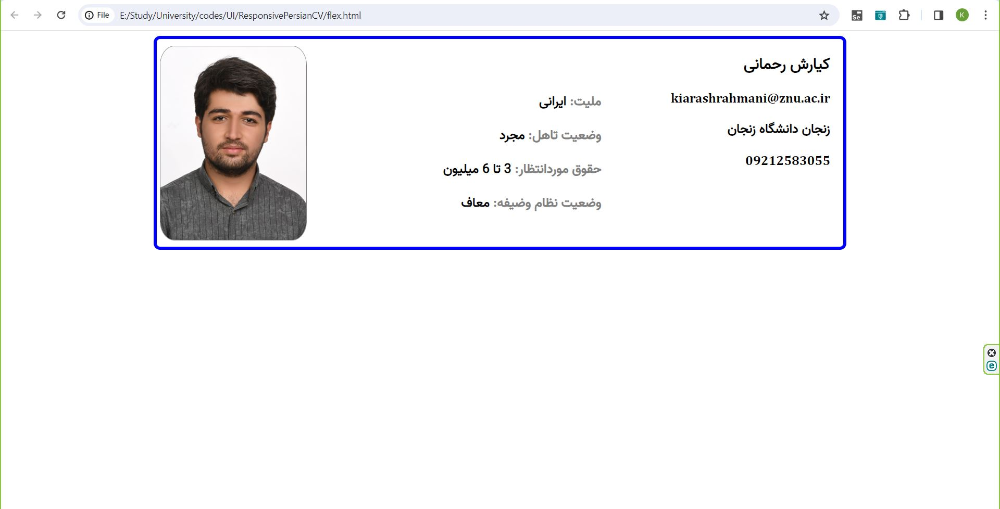

<!DOCTYPE html>
<html dir="rtl" lang="fa">

<head>
    <meta charset="UTF-8">
    <meta name="viewport" content="width=device-width, initial-scale=1.0">
   <!-- <title>ResponsivePersianCV README</title> -->
    <link rel="stylesheet" href="path/to/your/flex.css">
</head>

<body>

<h1>ResponsivePersianCV</h1>

ResponsivePersianCV is a responsive UI project showcasing a dynamic and visually appealing personal profile. Crafted using HTML with right-to-left (RTL) language support, this flexible and stylish resume incorporates Flexbox layout for enhanced responsiveness across various devices.

<h2>Key Features</h2>

<ul>
        <li><strong>RTL Language Support (Persian/Farsi)</strong></li>
        <li><strong>Flexbox Layout for Seamless Responsiveness</strong></li>
        <li><strong>Display of Personal Information, Educational Background, and Contact Details</strong></li>
        <li><strong>Integration of Stylish Design Elements</strong></li>
        <li><strong>Image Section for a Visual Touch</strong></li>
</ul>

<h2>Screenshots</h2>

</img>
<h2>Usage</h2>

<ol>
    <li>Clone the repository:</li>

 git clone https://github.com/your-username/ResponsivePersianCV.git

<li>Open the `index.html` file in your browser to view the personal profile.</li>
</ol>

<h2>License</h2>

This project is licensed under the <a href="LICENSE">MIT License</a>.

<h2>Author</h2>

Kiarash Rahmani - <a href="https://github.com/kiarashrahmani">kiarashrahmani</a>

</body>

</html>
